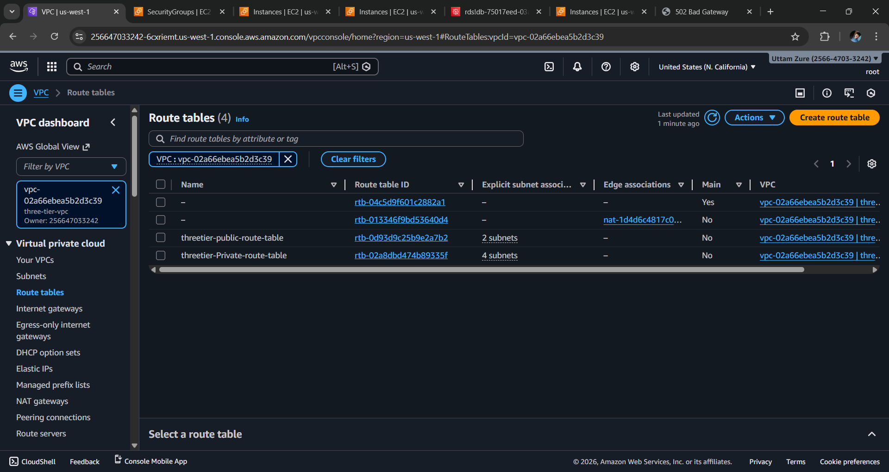

# Three-Tier Web Form Application Deployment Using AWS :red_circle:

## Description

 **This project is a hands-on walk through of a three-tier web architecture in AWS. We will be manually creating the necessary network, security, app, and database components and configurations in order to run this architecture in an available and scalable manner.**


## Audience:

It is intended for those who have a technical role. The assumption is that you have at least some foundational aws knowledge around VPC, EC2, RDS, ELB and the AWS Console.

## Pre-requisites: :link:

1. An AWS account. If you don’t have an AWS account, follow the instructions [here](https://aws.amazon.com/console/) and
   click on “Create an AWS Account” button in the top right corner to create one.
1. IDE or text editor of your choice.

## Architecture Overview  :round_pushpin:
---
  
---


            1. Web Tier (Public) – Nginx Reverse Proxy
            2. Application Tier (Private) – Nginx + PHP
            3. Database Tier (Private) – Amazon RDS (MariaDB)

### In this architecture, a public-facing Application Load Balancer forwards client traffic to our web tier EC2 instances. The web tier is running Nginx webservers that are configured to serve a React.js website and redirects our API calls to the application tier’s internal facing load balancer. The internal facing load balancer then forwards that traffic to the application tier, which is written in Node.js. The application tier manipulates data in an Aurora MySQL multi-AZ database and returns it to our web tier. Load balancing, health checks and autoscaling groups are created at each layer to maintain the availability of this architecture.

---

## Architecture Components:- :dart:

* **VPC** with CIDR `10.0.0.0/16`
* **6 Subnets** (2 Public + 4 Private)
* **2 Route Tables** (Public & Private)
* **Internet Gateway (IGW)**
* **NAT Gateway (NGW)**
* **Application Load Balancer (ALB)**
* **Auto Scaling Group (ASG)**
* **EC2 Instances** (web/Proxy, App, DB )
* **Amazon RDS (MariaDB)**

---


## Networking and Security - Part 1 

Now we will be building out the VPC networking components as well as security groups that will add a layer of protection around our EC2 instances, Aurora databases, and Elastic Load Balancers.

- Create an isolated network with the following components:
  - VPC
  - Subnets
  - Route Tables
  - Internet Gateway
  - NAT gateway
  - Security Groups


## Step 1: Create VPC

1. Go to **VPC Console** → Create VPC
2. Name: `three-tier-vpc`
3. CIDR Block: `10.0.0.0/16`
4. Enable DNS Hostnames & DNS Resolution


<b>NOTE</b>:  Make sure you pay attention to the region you’re deploying all your resources in. You’ll want to stay consistent for this workshop.


<b>NOTE</b>: Choose a CIDR range that will allow you to create at least 6 subnets.

---

## Step 2: Create Subnets

1. Next, create your subnets by navigating to Subnets on the left side of the dashboard and clicking Create subnet.

2. We will need six subnets across two availability zones. That means that three subnets will be in one availability zone, and three subnets will be in another zone. Each subnet in one availability zone will correspond to one layer of our three tier architecture. Create each of the 6 subnets by specifying the VPC we created in part 1 and then choose a name, availability zone, and appropriate CIDR range for each of the subnets.

### Public Subnets

* `Public-web-Subnet-1` → `10.0.2.0/24` (AZ-1)
* `Public-web-Subnet-2` → `10.0.1.0/24` (AZ-2)

### Private Subnets

* `Private-app-Subnet-1` → `10.0.11.0/24`
* `Private-app-Subnet-2` → `10.0.12.0/24`
* `Private-db-Subnet-1` → `10.0.21.0/24`
* `Private-db-Subnet-2` → `10.0.22.0/24`


---
## Step 3: Create Route Tables

1. Navigate to Route Tables on the left side of the VPC dashboard and click Create route table First, let’s create one route table for the web layer public subnets and name it accordingly
---



### Public Route Table

* Associate with **Public Subnets**
* Route:

  * `0.0.0.0/0` → Internet Gateway

2. Now create 2 more route tables, one for each app layer private subnet in each availability zone. These route tables will route app layer traffic destined for outside the VPC to the NAT gateway in the respective availability zone, so add the appropriate routes for that.

### Private Route Table

* Associate with **Private Subnets**
* Route:

  * `0.0.0.0/0` → NAT Gateway


---


## Step 4: Create Internet Gateway (IGW)

1. Create your internet gateway by simply giving it a name and clicking Create internet gateway.
 
 2. After creating the internet gateway, attach it to your VPC.


---

## Step 5: Create NAT Gateway

1. In order for our instances in the app layer private subnet to be able to access the internet they will need to go through a NAT Gateway. For high availability, you’ll deploy one NAT gateway in each of your public subnets. Navigate to NAT Gateways on the left side of the current dashboard and click Create NAT Gateway.

2. Fill in the Name, choose one of the public subnets you have created, and then allocate an Elastic IP. Click Create NAT gateway.


---

##  Instance Deployment - Part 2


### 1. Web Server (Proxy – Public)

1. Navigate to the EC2 service dashboard and click on Instances on the left hand side. Then, click Launch Instances.

2. Select the first Amazon Linux 2 AMI

3. We'll be using the free tier eligible <b>T.2 micro</b> instance type. Select that and click Next: Configure Instance Details.
4. When configuring the instance details, make sure to select to correct Network, subnet, and IAM role we created. Note that this is the ``web layer`` so use one of the **public** subnets we created for this layer.
5. Earlier we created a security group for our three tier project so go ahead and select that in this next section. Then click Review and Launch. Ignore the warning about connecting to port 22- we don't need to do that.

### Connect to Instance
## In this architecture, direct SSH access to private servers is not allowed. The Web (Proxy) Server acts as a Bastion (Jump) Host.

**SSH to Web (Proxy) Server (Public)**

### From your local machine:

`` ssh -i my-key.pem ec2-user@<WEB_PUBLIC_IP> ``

##  Install Nginx on Web (Proxy) Server

```bash
sudo yum update -y
sudo yum install nginx -y
sudo systemctl start nginx
sudo systemctl enable nginx
```


---

## Configure Nginx as Reverse Proxy

Edit file:

```bash
sudo vim /etc/nginx/nginx.conf
```

Add:

```nginx
location / {
    proxy_pass http://<APP_PRIVATE_IP>;
    proxy_set_header Host $host;
    proxy_set_header X-Real-IP $remote_addr;
}
```

Restart Nginx:

```bash
sudo systemctl restart nginx
```


### 2. App Server (Private)

1. Navigate to the EC2 service dashboard and click on Instances on the left hand side. Then, click Launch Instances.

2. Select the first Amazon Linux 2 AMI

3. We'll be using the free tier eligible <b>T.2 micro</b> instance type. Select that and click Next: Configure Instance Details.
4. When configuring the instance details, make sure to select to correct Network, subnet, and IAM role we created. Note that this is the ``app layer`` so use one of the **private** subnets we created for this layer.
5. Earlier we created a security group for our three tier project so go ahead and select that in this next section. Then click Review and Launch. Ignore the warning about connecting to port 22- we don't need to do that.


## How Web/Proxy, App & Servers Connect (SSH Access)

### In this architecture, direct SSH access to private servers is not allowed. The Web (Proxy) Server acts as a Bastion (Jump) Host.

SSH from Web Server to App Server (Private)

**After logging into the Web Server:**

```bash 
ssh -i my-key.pem ec2-user@<APP_PRIVATE_IP>
```

##  Install Nginx & PHP on App Server

```bash
sudo yum install nginx php php-mysqlnd -y
sudo systemctl start nginx
sudo systemctl enable nginx
```
---
##  Deploy Application Code

Location:

```bash
cd /usr/share/nginx/html
```

### form.html

* HTML form for Name & City
---


### PHP script to insert data into RDS MariaDB
### submit.php


### 3. DB Server (Private)

1. Navigate to the EC2 service dashboard and click on Instances on the left hand side. Then, click Launch Instances.

2. Select the first Amazon Linux 2 AMI

3. We'll be using the free tier eligible <b>T.2 micro</b> instance type. Select that and click Next: Configure Instance Details.
4. When configuring the instance details, make sure to select to correct Network, subnet, and IAM role we created. Note that this is the ``DB layer`` so use one of the **private** subnets we created for this layer.
5. Earlier we created a security group for our three tier project so go ahead and select that in this security group Then click Review and Launch.

## How Web/Proxy, DB & Servers Connect (SSH Access)

### In this architecture, direct SSH access to private servers is not allowed. The Web (Proxy) Server acts as a Bastion (Jump) Host.

SSH from Web Server to DB Server (Private)

**After logging into the Web Server:**

```bash 
ssh -i my-key.pem ec2-user@<DB_PRIVATE_IP>
```

---


## Database Configuration

```sql
CREATE DATABASE facebook;
USE facebook;
CREATE TABLE users (
  id INT AUTO_INCREMENT PRIMARY KEY,
  name VARCHAR(50),
  city VARCHAR(50)
);
```

# Database Deployment - Part 3

- Deploy Database Layer
  - Subnet Groups
  - Multi-AZ Database

## Subnet Groups

1. Navigate to the RDS dashboard in the AWS console and click on Subnet groups on the left hand side. Click Create DB subnet group.
2. Give your subnet group a name, description, and choose the VPC we created.
3. When adding subnets, make sure to add the subnets we created in each availability zone specificaly for our database layer. You may have to navigate back to the VPC dashboard and check to make sure you're selecting the correct subnet IDs.
  

##  Create RDS (MariaDB)

1. Navigate to Databases on the left hand side of the RDS dashboard and click Create database.

2. We'll now go through several configuration steps. Start with a Standard create for this MySQL-Compatible ``MariDB`` database. Leave the rest of the defaults in the Engine options as default.

Set the security group we created for the database layer, make sure password authentication is selected as our authentication choice, and create the database.

 3. When your database is provisioned, you should see a reader and writer instance in the database subnets of each availability zone. Note down the writer endpoint for your database for later use.

---


---
## Create Application Load Balancer (ALB)

1. On the left hand side of the EC2 dashboard select <b>Load Balancers</b> under <b>Load Balancing</b> and click <b>Create Load Balancer</b>.

2. We'll be using an <b>Application Load Balancer </b>for our <b>HTTP </b>traffic so click the create button for that option.

3. After giving the load balancer a name, be sure to select <b>internal</b> since this one will not be public facing, but rather it will route traffic from our web tier to the app tier.

Select the correct network configuration for VPC and private subnets.

Select the security group we created for this internal ALB. Now, this ALB will be listening for HTTP traffic on port 80. It will be forwarding the traffic to our <b>target group </b>that we just created, so select it from the dropdown, and create the load balancer.


---

## Create AMI 

Create AMI(Amazon Machine Image) of Webserver and Appserver for AutoSCaling


## Target Group

While the AMI is being created, we can go ahead and create our target group to use with the load balancer. On the EC2 dashboard navigate to Target Groups under Load Balancing on the left hand side. Click on Create Target Group.


## Auto Scaling Group (ASG)


1. We will now create the Auto Scaling Group for our web instances. On the left side of the EC2 dashboard navigate to **Auto Scaling Groups** under **Auto Scaling** and click **Create Auto Scaling group**.

2. Give your Auto Scaling group a name, and then select the Launch Template we just created and click next.

3. On the **Choose instance launch options** page set your VPC, and the public subnets for the web tier and continue to step 3.

4. For this next step, attach this Auto Scaling Group to the Load Balancer we just created by selecting the existing web tier load balancer's target group from the dropdown. Then, click next.

5. For **Configure group size and scaling policies**, set desired, minimum and maximum capacity to **2**. Click skip to review and then Create Auto Scaling Group.
---


---

## Final Testing (Detailed Description)

After completing the infrastructure setup and application deployment, the final testing phase was performed to verify end-to-end functionality, connectivity between tiers, security rules, and high availability.

1. Web Tier Testing (Proxy Server)

* Accessed the Public IP / ALB DNS of the Web (Proxy) Server from the browser.

* Verified that Nginx service is running and listening on port 80.

* Confirmed that requests are successfully forwarded to the ``Application Tier`` using Nginx reverse proxy.

Tested multiple refreshes to ensure consistent response.


2. Application Tier Testing

* Verified that Nginx + PHP services are running on the App Server.

* Confirmed that form.html loads correctly when accessed via Proxy Server.

* Checked file permissions under /usr/share/nginx/html.

* Ensured PHP processing works correctly (PHP files are not downloaded).
---


3. Form Submission Testing

* Entered valid data (Name & City) into the web form.

* Clicked Submit button.

* Verified that the request reached submit.php through the Proxy.

* Confirmed that a ``Data inserted successfully!`` message is displayed after submission.


---

4. Database Connectivity Testing (RDS)

* Verified that the Application Server connects to RDS MariaDB endpoint.

* Checked Security Groups:

* Port 3306 allowed only from App Server SG.

* Verified database insertion by logging into RDS:

* ```SELECT * FROM users;```

* Confirmed submitted data is successfully stored.


## Conclusion

This project successfully implements a **Highly Available, Scalable, and Secure Three-Tier Web Application Using AWS** best practices.